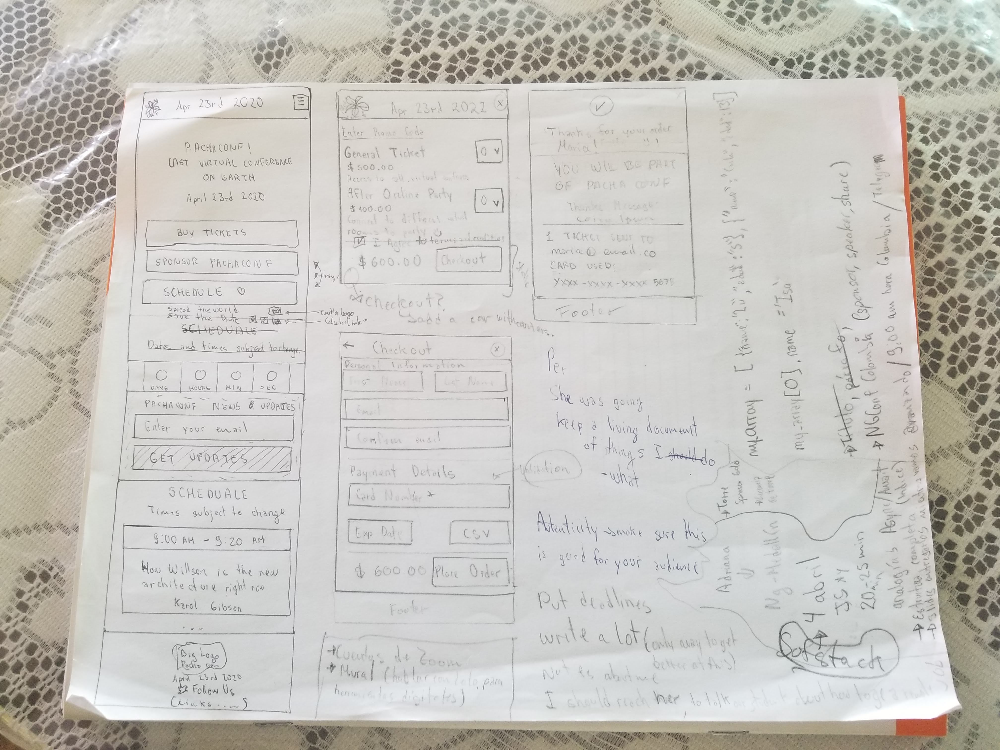

# PachaConf

This project is the event page for PachaConf where you can buy your tickets for the online conference :)

# Investigacion UX
1. Users of this project are enviromental activists who want to attend a global conference in order to celebrate the international day of planet earth.
2. This project is meant to help to register the attendants in the virtual event.
3. First prototype
4. Feedback I have gotten
5. Image of final prototype

## Here are my first sketches for this project

## This is the final low fidelity sketch for this project

## Final image of my project - high fidelity

## TO DO
- [x] Check before submit if all fields are correct
- [x] Check if inputs on the checkout view are filled, they are REQUIRED.
  - [x] Validate Required fields is working?
  - [x] first name
  - [x] last name
  - [x] email
  - [x] confirm email must be equal to email
  - [x] card number
  - [x] exp date
  - [x] csv
- [x] La imagen final de tu proyecto.
- [x] Change double quotes for single quotes in JS.
- [x] HTML change camelCase to -Case
- [x] Change functions by arrow functions
- [ ] Center some elements.
- [ ] Enter Promo Code Interactivity.
- [x] Change innerHTML for textContent when not html needed.
- [x] Rewrite luhn algorithm
- [x] Check tests
- [x] Write tests
- [x] Validation form -> GET First Name, email, card encrypted.
- [x] Un título con el nombre de tu proyecto.
- [x] Un resumen de 1 o 2 líneas de qué se trata tu proyecto.
- [x] Investigación UX:
  - [x] Explicar quiénes son los usuarios y los objetivos en relación con el
    producto.
  - [x] Explicar cómo el producto soluciona los problemas/necesidades de dichos
    usuarios.
  - [x] Luego colocarás la foto de tu primer prototipo en papel.
  - [x] Agregar un resumen del feedback recibido indicando las mejoras a realizar.
  - [x] Imagen del prototipo final.

## Questions to Lupo/Mariano
- Is the luhn algorithm well explained? I think the image (spacially the arroy) confuses the developer.
- Should I have used labels instead of paragraphs after inputs?
- Should I use onblur by default vs addEventListener with the event blur?

## Topics to check
- Is it responsive?
- Can we create the cart animation increase in numbers?
- Name vs Id wich one to use in forms
- min lenght 
- Card Generators (create a good one!)
- Section or Div?
- Where do I learn CSS? Udacity has a good starting point for responsiveness
- How do they create that small icon card to show in the input for card number
- Why do they not use the word function?
- JS events https://developer.mozilla.org/en-US/docs/Learn/JavaScript/Building_blocks/Events (onclick vs addeventlistener)
- Why do they not use this keyword, why is not allowed in laboratoria?
- BIND concept in JS https://www.freecodecamp.org/news/when-and-why-you-should-use-es6-arrow-functions-and-when-you-shouldnt-3d851d7f0b26/
- Create supper inputs? Like texts that get smaller and then are bigger

## New things learned
- Clear the float whenever you need to get a new line after a float:left
- If working with a forked repository you will probably want to add a new remote
  - git remote add upstream ULR_GIT_REPO
- If you need to list your remotes use:
  - git remote -v 
- TODO comments only work in programming languages (JS) and not for HTML (markup language)
- Chrome browser will recognize a credit card input if you use the the attribute name="cardNumber" or placeholder="Card Number*"
- Input pattern attribute only suggest when you over an input and wrote another thing to write the requested format.
- HTML5 discourages the use of type=text/javascript https://stackoverflow.com/questions/51418964/script-type-text-javascript-vs-script-type-module
- onclick is a bad practice https://www.simonewebdesign.it/onclick-vs-addeventlistener/
- repeat and slice methods for strings!
- onblur is for when something is out of focus

## Test with credit cards generated
bestccgen.com/bulkcardgenerator-result.php?network=visa&noc=20
